# PV Strings — Dashboard

Cards and a zero-configuration dashboard strategy for the
[PV Strings](https://github.com/doccodyblue/ha-pvstrings) integration.

Install it, add the strategy, and you get a working dashboard for however many
strings you have — without opening a card editor. Or ignore the strategy and
use the cards on their own.

**Optional.** The integration publishes everything through ordinary entities
and attributes and works perfectly well without any of this.

| | |
|---|---|
| 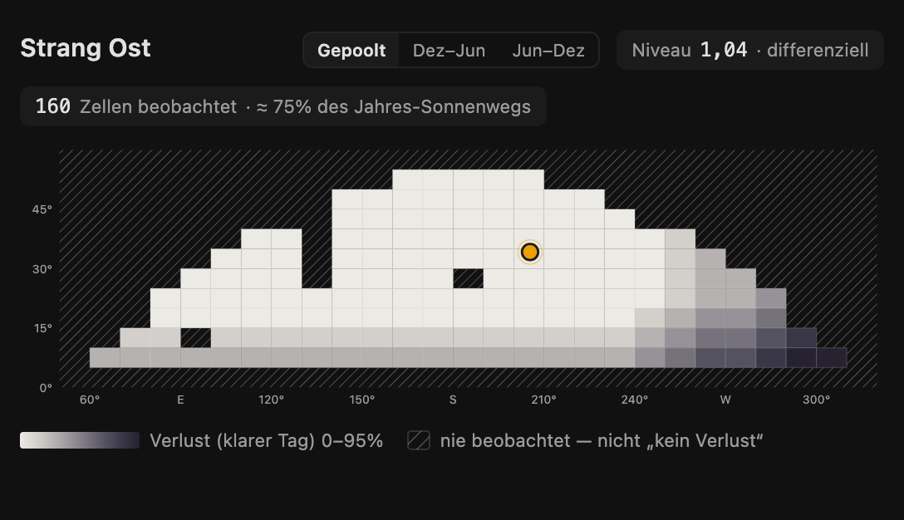 | 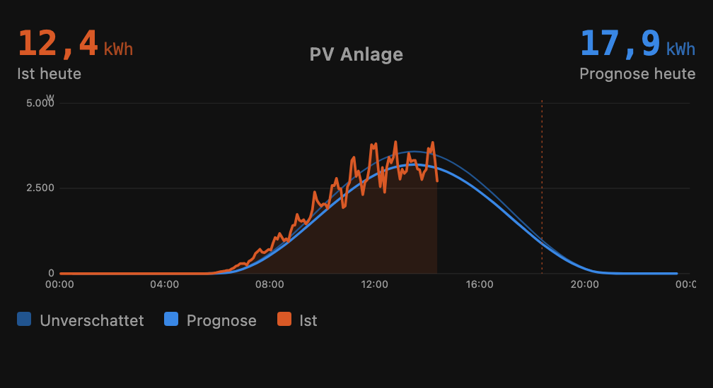 |
| 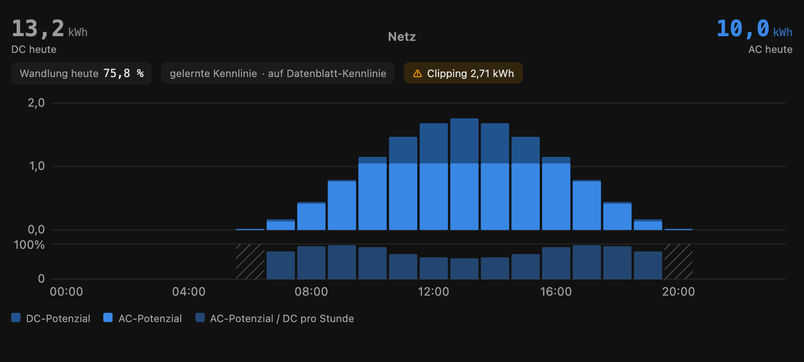 | 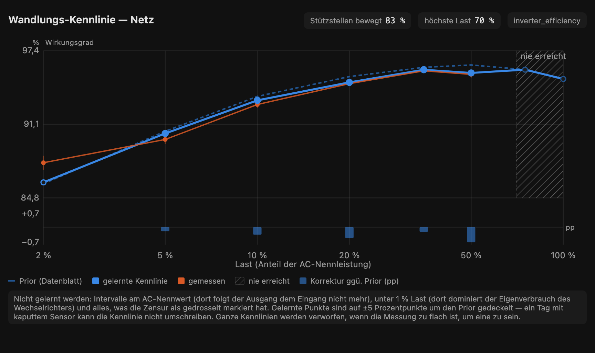 |

---

## Installation

### HACS (recommended)

1. HACS → three-dot menu → **Custom repositories**
2. Repository: `doccodyblue/ha-pvstrings-dash`, type: **Dashboard**
3. Install **PV Strings Dashboard**. HACS registers the Lovelace resource
   automatically.

### Manual

Copy `pvstrings-dash.js` to `/config/www/` and add a Lovelace resource:
`/local/pvstrings-dash.js`, type *JavaScript module*.

### The generated dashboard

Settings → Dashboards → **Add dashboard** → *New dashboard from scratch*,
then open it, enter the raw configuration editor (three-dot menu) and replace
the content with:

```yaml
strategy:
  type: custom:pvstrings
```

That is the entire configuration. The strategy reads the entity registry and
builds four views: **Overview** (today, remaining, tomorrow, power, forecast
chart, savings — written for people, not for debugging), **Strings** (one
section per string: forecast line chart, sky map, shading, yield),
**Accuracy** (short-term vs day-ahead, with the day-by-day comparison), and
**Nerd** (training maturity, learning buckets, source-bias table, collection
health, skip reasons). Views follow `hass.language` (German/English). The generated YAML
is a normal dashboard config — take it over and edit it if you want to.

---

## The cards

Four conventions run through all of them, and each one exists to prevent a
specific misreading.

**Hatched means never observed — not "zero".**

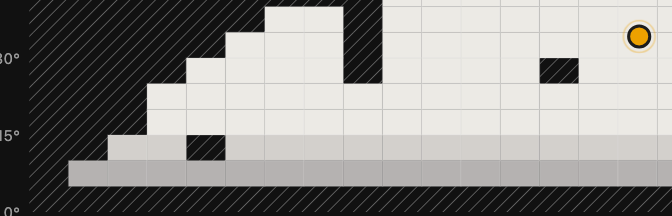

A sky cell the sun has never crossed is hatched rather than painted with the
light end of the loss ramp: "nobody measured this" and "nothing shades this"
mean opposite things, and confusing them once made a broken map look healthy
for two days. The same hatch marks hours whose DC is too small to divide by,
and loads a plant will never reach.

**Dashed means "not the thing itself".**

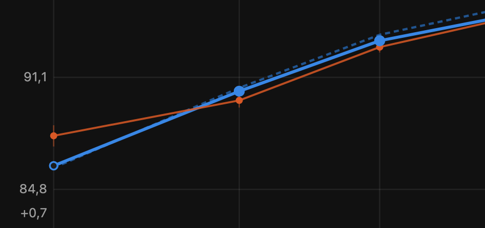

On the conversion-curve card the dashed line is the datasheet prior, the solid
line is what the plant actually applies, and orange is the raw measurement —
blue is the model and orange the measurement, in every card. Filled markers
sit where evidence has moved a support point, hollow ones still hold their
prior. While nothing has moved, the applied curve stays dashed as well: a
solid "learned" line would claim a measurement that has not been accepted.

**A second strip carries what the main scale would hide.**

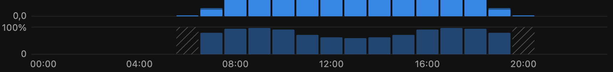

Hourly conversion runs somewhere between 70 and 97 %, which on the energy axis
above would be invisible inside the bars. The strip below has its own 0–100 %
scale: lower at dawn and dusk where the inverter is inefficient, dipping at
midday where clipping cuts the AC — a hardware cap, not a conversion loss,
which is why clipping also gets its own chip. The curve card uses the same
device for its correction in percentage points.

**A withheld figure says how far off it is.**


Nothing is ever silently blank. Where a value cannot be shown, its place is
taken by the reason — here the nowcast shortly after a restart, waiting for
enough measured intervals, which is a normal state and not an error. The same style covers "no cells learned yet", "no learning
region built", and every other not-yet.


### `pvstrings-sky-map`

The learned sky as a grid over sun position: ten degrees of azimuth by five of
elevation, only the observed range drawn, with the sun's current position
marked.

```yaml
type: custom:pvstrings-sky-map
entity: sensor.<string>_sky_map      # German installs: sensor.<strang>_himmelskarte
show_sun: true      # optional
seasons: true       # optional — seasonal layer toggle when split cells exist
```

Two things it deliberately gets right, both learned the hard way:

- **A cell nobody has observed is not a cell with no loss.** Unobserved cells
  are hatched neutral — never the light end of the loss ramp.
- **A flat map is meaningless without knowing what it is measured against.**
  The fit level and method are always on the card: a *differential* map is
  fitted against the sibling strings and its losses are clear-day losses; a
  string with no level (single string, or too few shared epochs) says
  *absolute* instead of pretending.

### `pvstrings-forecast`

Hourly forecast, unshaded potential, and actual production — one axis.
The gap between unshaded and forecast is the shadow the model knows; the gap
to the measurement is what it does not.

```yaml
type: custom:pvstrings-forecast
entity: sensor.<plant>_forecast_today   # plant, string, or curtailment group
days: 2             # 1–3
style: bars         # or: line
show_unshaded: true
show_actual: true
```

`style: line` (what the strategy uses for string sections) draws the actual
series from the string's configured power entity via the recorder's
**5-minute statistics** — the high resolution comes from real data, never
from smoothing. Forecast and unshaded stay hourly, drawn as straight
segments. If no 5-minute statistics exist, the card falls back to hourly
means and says so on the card.

### `pvstrings-conversion`

DC potential vs converted output for one inverter group — AC behind the
inverter for `direct` groups, battery charge for `storage` groups (PV
Strings ≥ 1.20 with a configured output path; without one, none of this
exists and none of it is drawn). Below the bars sits a per-hour ratio
strip that makes the conversion curve visible: lower at dawn and dusk,
dipping under clipping. Hours with too little DC for a meaningful
quotient are hatched, not faked.

```yaml
type: custom:pvstrings-conversion
entity: sensor.<gruppe>_restprognose_ac_heute   # or …_akkuladung_heute
dc_entity: sensor.<gruppe>_rest_heute
```

Three semantic guard rails, straight from the integration's contract: AC
and battery charge are never added (different kinds of energy); the AC
figure is hardware potential — capped at the inverter's AC rating, never
at regulatory limits; and clipping is shown as its own chip because a
hardware cap is not a conversion loss. A header chip names what produced
the output figure — datasheet or custom curve, fixed factors with their
applied multiplier, or "unconverted" when no path is configured.

### `pvstrings-nowcast`

The forecast reacting to your own irradiance sensor (PV Strings ≥ 1.21).
The measured clearness of the last quarter hour is blended into the
coming intervals and fades back to the provider's forecast; the card
shows the clearness on a 0–1.1 scale, the weight on the next interval,
and how fast it fades — half-life marked on the curve, reach capped at
two hours.

```yaml
type: custom:pvstrings-nowcast
entity: sensor.<anlage>_einstrahlung_prognose
```

Inactive at night and on plants without a sensor is the normal state,
so the card shows the *reason* rather than an error. The fade curve is
computed from the two published figures and says so — the integration
publishes no per-interval curve.

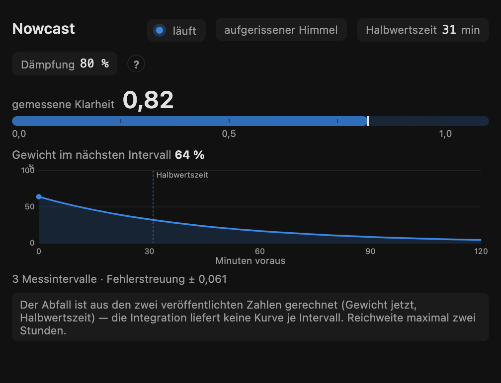

### `pvstrings-curve`

The learned efficiency curve against the datasheet prior it started from
(PV Strings ≥ 1.21). Efficiency over load on a log axis — the shape lives
in the main plot, the correction in a strip below, because learning moves
points by tenths of a percentage point and would be invisible at the
curve's own scale.

```yaml
type: custom:pvstrings-curve
entity: sensor.<gruppe>_restprognose_ac_heute
```

Four states the card keeps apart, because the integration does: learning
switched off (nothing to draw), switched on and collecting (the applied
curve stays dashed — a solid "learned" line would be a lie), learned
(solid line over the dashed prior, filled markers where measurement moved
the point), and refused — when the inverter reports a calculated AC value
instead of a measured one, the fit is blocked and the card says so
calmly, with the flat measurement still on the chart because seeing it
flat is what explains the refusal. Loads the plant has never reached are
hatched, the same grammar the sky map uses for cells the sun never
crossed.

### `pvstrings-chain`

What each layer did to the raw physics for one hour: physics → × sky map →
× per-string model → published, with the measurement beside it. The source
bias is shown as context, not as a link — it was applied upstream and is
already inside the physics figure. The card also verifies the multiplication
it displays and complains loudly if the invariant does not hold.

```yaml
type: custom:pvstrings-chain
entity: sensor.<string>_forecast_today   # needs the per-string chain attrs
hour: now
```

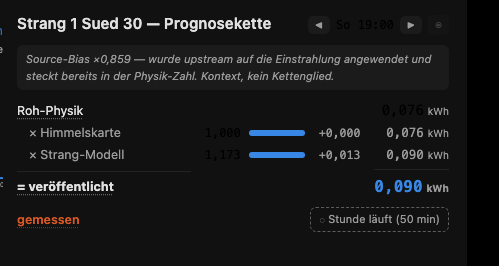

### `pvstrings-daily`

Day-ahead forecast against actual production, day by day. The day-ahead value
is reconstructed from long-term statistics: the value of `forecast_tomorrow`
as recorded in the issue hour (18:00) of the evening before — the same
definition the integration's own `deviation_yesterday` uses, and verified
against it. Days without an evening forecast show a hatched "no forecast
issued" marker, never a zero bar.

```yaml
type: custom:pvstrings-daily
entity: sensor.<plant>_forecast_today    # any sensor of the target device
days: 14
```

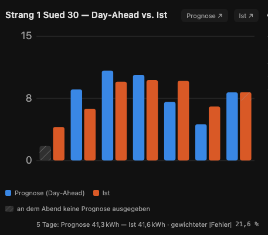

### `pvstrings-kv-table`

Small diagnostic table renderer the nerd view is built from (learning
buckets, source-bias matrix, censoring split, skip reasons). Every table
header links to its source entity. Usable standalone via `mode:` —
see the strategy-generated YAML for examples.

### `pvstrings-maturity`

How far the training has come, on two axes with deliberately different
clocks — one blended number would hide exactly that:

- **Weather correction**: the evidence held across all weather × daypart
  buckets, relative to the most a bucket can ever hold. The learning forgets
  slowly, so the count saturates — 100 % means "as learned as it gets",
  not "finished".
- **Shading**: the share of the year's sun path each string has observed
  (the same figure the sky-map card shows per string, aggregated). This one
  can only grow as fast as the calendar moves the sun.

```yaml
type: custom:pvstrings-maturity
entity: sensor.<plant>_model_observations
rows:
  - name: East
    sky: sensor.<string>_sky_map
```

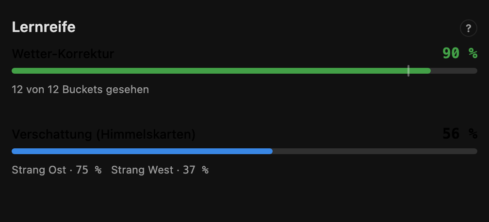

---

## The contract

Cards **detect the attributes they need**, and never sniff a version number.
When something is missing they say which attribute, and which integration
version introduced it:

> needs `level & fit_method` on `sensor.…_sky_map` (PV Strings ≥ 1.18.0)

Feature detection rather than a version string, because the question a card
actually has is "can I draw this", not "what release is this".

A missing entity is reported in place. The strategy never silently omits a
card it meant to include.

| Feature | Needs PV Strings |
|---|---|
| forecast card (hourly + unshaded) | ≥ 1.8.0 |
| chain card (per-hour factors) | ≥ 1.8.0 |
| sky map with `level` / `fit_method` | ≥ 1.18.0 |
| curtailment-group sections | ≥ 1.14.0 |
| conversion cards (AC / battery charge, optional) | ≥ 1.20.0 |
| learned conversion curve (`conversion_learning`) | ≥ 1.21.0 |
| nowcast card (`nowcast_active`) | ≥ 1.21.0 |
| daily card (issue-hour reconstruction) | ≥ 1.10.0 |

The three design rules behind all of this, bought with the integration's own
bug history (three arithmetic bugs, all of which looked exactly like "not
enough data yet" from the outside):

1. **"Not yet" and "nothing" never look the same.** Every withheld figure
   shows how far off publishing it is, in the place the figure would be.
2. **Every derived number can be traced to its inputs** in at most one click.
3. **A card that cannot draw something says why.** Never an empty panel.

---

## Why a separate repository

HACS classifies a repository as *either* an integration *or* a Lovelace
plugin, and it decides from the layout. A repository carrying
`custom_components/` is an integration and its JavaScript cannot be installed
as a plugin. So the cards live here.

The split has a second benefit and one real cost. The benefit: a card gets
fiddled with ten times in an evening, and coupling that to integration
releases would mean restarting Home Assistant ten times. The cost is version
skew, and it fails quietly — which is exactly what *The contract* above is
for.

---

## Development

One ES module, plain JavaScript, no build step — `pvstrings-dash.js` is both
source and artifact. The `tools/` directory carries the dev loop:

- `tools/serve.mjs` — serves the repo with CORS so a Lovelace resource can
  point at your dev machine
- `tools/ha-ws.mjs` — minimal HA websocket client (`HA_URL` / `HA_TOKEN`)
- `tools/test.html` — renders every card with live data from your instance,
  plus a strategy dry-run: `http://localhost:8099/tools/test.html?dark=1#token=<long-lived-token>`
- `deploy.sh` — syntax-check, optional scp to `/config/www/`, cache-busts the
  resource
