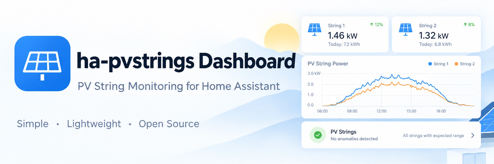
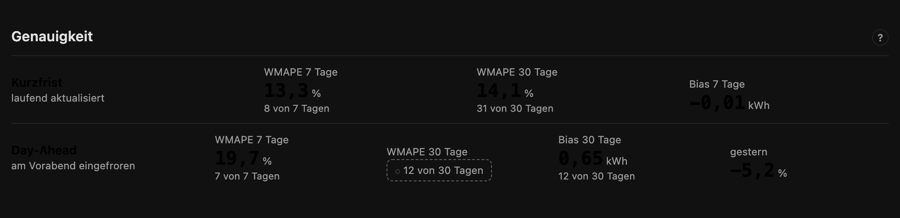
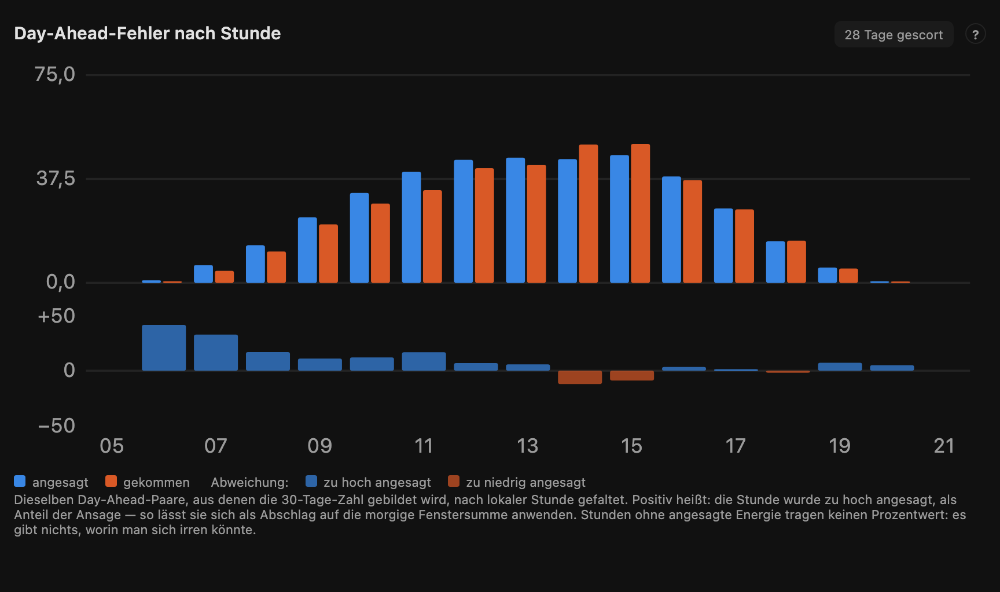
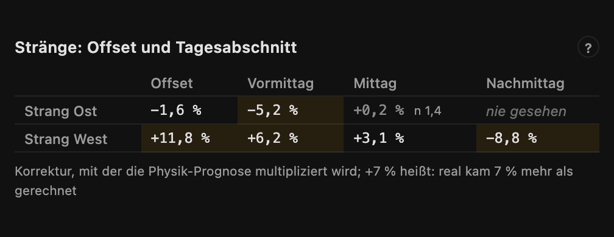
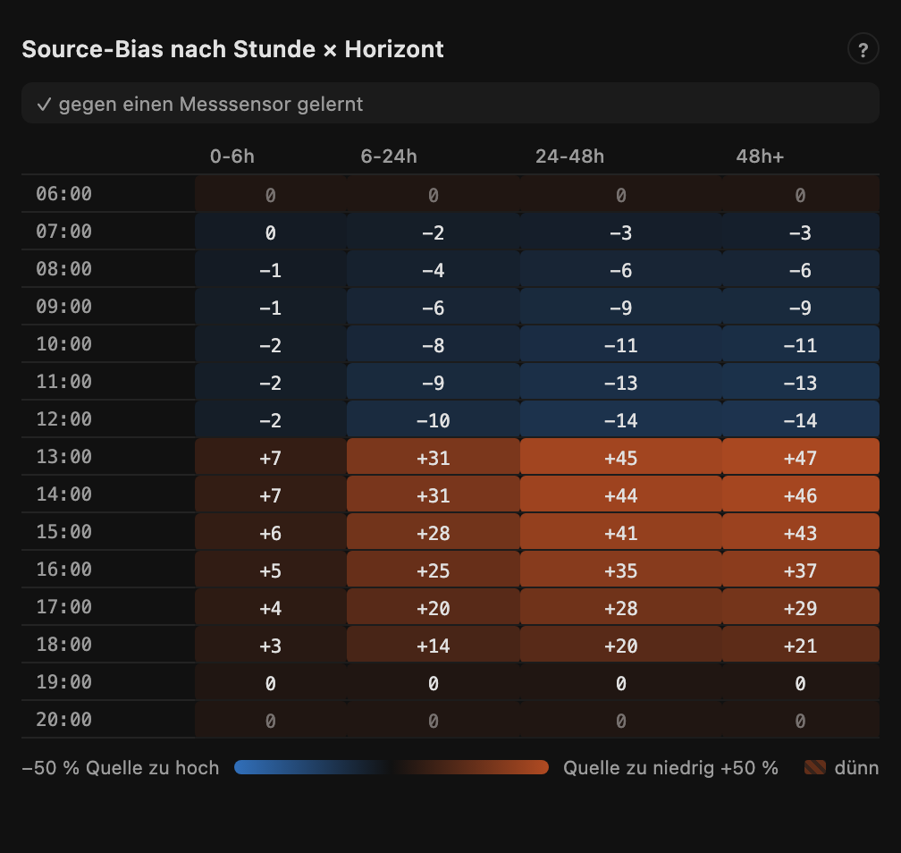
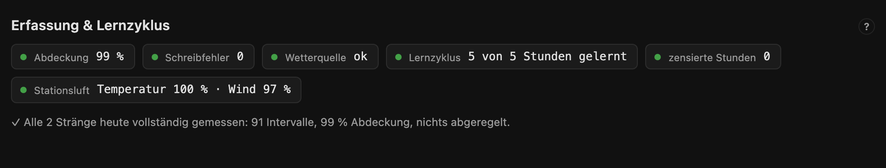
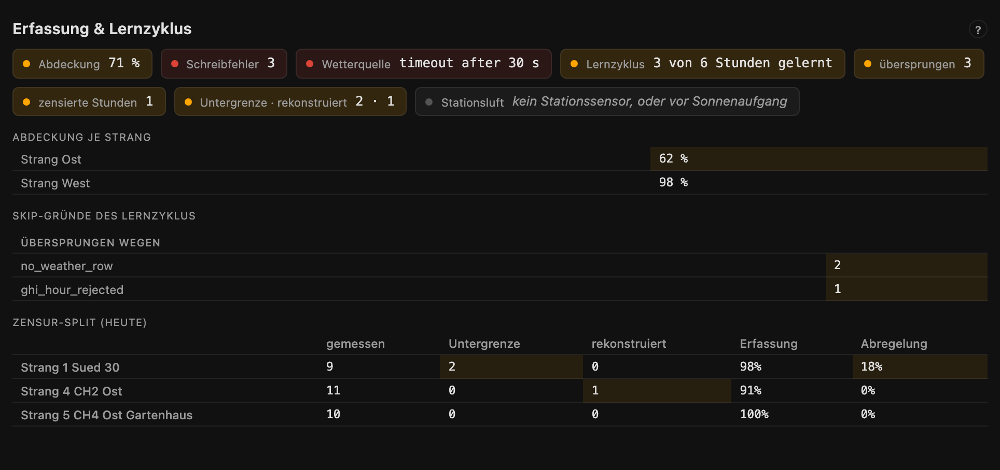
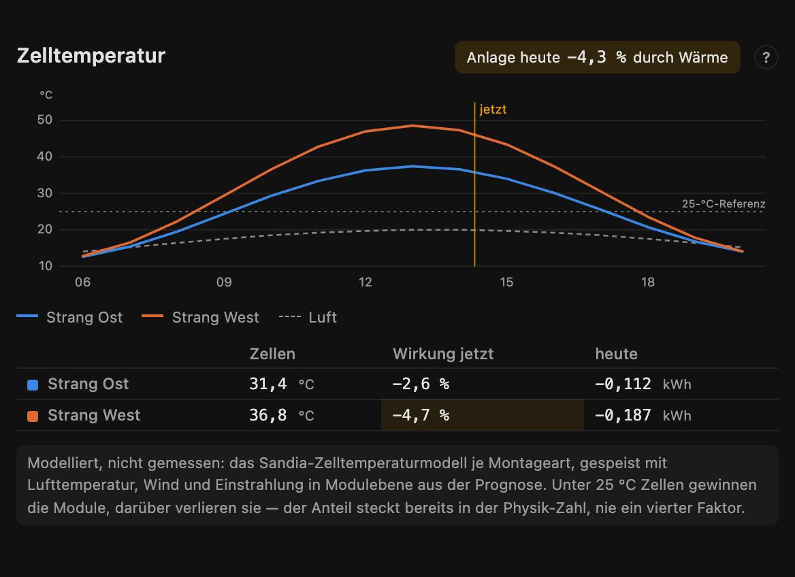

# PV Strings — Dashboard



Cards and a zero-configuration dashboard strategy for the
[PV Strings](https://github.com/doccodyblue/ha-pvstrings) integration.

Install it, add the strategy, and you get a working dashboard for however many
strings you have — without opening a card editor. Or ignore the strategy and
use the cards on their own.

**Optional.** The integration publishes everything through ordinary entities
and attributes and works perfectly well without any of this.

## What these cards are for

Home Assistant draws a time series well, and for a plant total that is all you
need. What it has no way to draw is the sky: a grid over sun position, one per
string, saying where each of them loses what.

That picture is why this repository exists. On the reference plant two strings
of identical azimuth and tilt read 0.3 % and 67.7 % loss in one and the same
sky cell — a neighbour's house stands in one of them in the morning. In a table
of numbers that is noise. As two maps side by side it is obvious, and specific
enough to walk outside and confirm.

| | |
|---|---|
|  |  |
|  |  |

---

## Installation

### HACS (recommended)

Search for **PV Strings Dashboard** in HACS and install it; HACS registers the
Lovelace resource automatically.

Not there yet? The repository is awaiting inclusion in the HACS default store,
which takes a while. Until then: HACS → three-dot menu → **Custom
repositories** → `doccodyblue/ha-pvstrings-dash`, type **Dashboard**.

### Manual

Copy `pvstrings-dash.js` to `/config/www/` and add a Lovelace resource:
`/local/pvstrings-dash.js`, type *JavaScript module*.

### The generated dashboard

Settings → Dashboards → **Add dashboard** → *New dashboard from scratch*,
then open it, enter the raw configuration editor (three-dot menu) and replace
the content with:

```yaml
strategy:
  type: custom:pvstrings
```

That is the entire configuration. The strategy reads the entity registry and
builds four views: **Overview** (today, remaining, tomorrow, power, forecast
chart, savings — written for people, not for debugging), **Strings** (one
section per string: forecast line chart, sky map, shading, yield, cell
temperature), **Accuracy** (one card of figures — short-term and day-ahead,
each with how full its window is — and one day-by-day chart that switches
between the plant and its strings), and the **Nerd Dashboard** (status first, numbers on demand:
training maturity and a one-line collection health strip, the day-ahead error
by hour, the correction factors as percentages, the source bias as a heatmap,
the sky-map overview, the modelled cell temperature, the conversion layer, and
— where a price sensor or a battery makes it meaningful — what the savings
figure rests on). Every card on it carries a **?** with the paragraph that
explains its numbers. Views follow `hass.language` (German and English). The
generated YAML is a normal dashboard config — take it over and edit it if you
want to.

The Nerd Dashboard folds tables away where they would only say "healthy": the
skip reasons, the censoring split and the per-string coverage appear when a
figure deviates, and not before. For debugging, the raw view is one line away:

```yaml
strategy:
  type: custom:pvstrings
  diagnostics: full
```

restores every raw table, the evidence count on every cell and the explainer
footer — and on the Accuracy view lays the six day-by-day charts out side by
side again instead of behind a selector.

---

## The cards

Four conventions run through all of them, and each one exists to prevent a
specific misreading.

**Hatched means never observed — not "zero".**


A sky cell the sun has never crossed is hatched rather than painted with the
light end of the loss ramp: "nobody measured this" and "nothing shades this"
mean opposite things, and confusing them once made a broken map look healthy
for two days. The same hatch marks hours whose DC is too small to divide by,
and loads a plant will never reach.

**Dashed means "not the thing itself".**


On the conversion-curve card the dashed line is the datasheet prior, the solid
line is what the plant actually applies, and orange is the raw measurement —
blue is the model and orange the measurement, in every card. Filled markers
sit where evidence has moved a support point, hollow ones still hold their
prior. While nothing has moved, the applied curve stays dashed as well: a
solid "learned" line would claim a measurement that has not been accepted.

**A second strip carries what the main scale would hide.**


Hourly conversion runs somewhere between 70 and 97 %, which on the energy axis
above would be invisible inside the bars. The strip below has its own 0–100 %
scale: lower at dawn and dusk where the inverter is inefficient, dipping at
midday where clipping cuts the AC — a hardware cap, not a conversion loss,
which is why clipping also gets its own chip. The curve card uses the same
device for its correction in percentage points.

**A withheld figure says how far off it is.**


Nothing is ever silently blank. Where a value cannot be shown, its place is
taken by the reason — here the nowcast shortly after a restart, waiting for
enough measured intervals, which is a normal state and not an error. The same
style covers "no cells learned yet", "no learning region built", and every
other not-yet.


### `pvstrings-sky-map`

The learned sky as a grid over sun position: ten degrees of azimuth by five of
elevation, only the observed range drawn, with the sun's current position
marked.

```yaml
type: custom:pvstrings-sky-map
entity: sensor.<string>_sky_map      # German installs: sensor.<strang>_himmelskarte
show_sun: true      # optional
seasons: true       # optional — seasonal layer toggle when split cells exist
```

Two things it deliberately gets right, both learned the hard way:

- **A cell nobody has observed is not a cell with no loss.** Unobserved cells
  are hatched neutral — never the light end of the loss ramp.
- **A flat map is meaningless without knowing what it is measured against.**
  The fit level and method are always on the card: a *differential* map is
  fitted against the sibling strings and its losses are clear-day losses; a
  string with no level (single string, or too few shared epochs) says
  *absolute* instead of pretending.

### `pvstrings-forecast`

Hourly forecast, unshaded potential, and actual production — one axis.
The gap between unshaded and forecast is the shadow the model knows; the gap
to the measurement is what it does not.

```yaml
type: custom:pvstrings-forecast
entity: sensor.<plant>_forecast_today   # plant, string, or curtailment group
days: 2             # 1–3
style: bars         # or: line
show_unshaded: true
show_actual: true
```

`style: line` (what the strategy uses for string sections) draws the actual
series from the string's configured power entity via the recorder's
**5-minute statistics** — the high resolution comes from real data, never
from smoothing. Forecast and unshaded stay hourly, drawn as straight
segments. If no 5-minute statistics exist, the card falls back to hourly
means and says so on the card.

### `pvstrings-conversion`

DC potential vs converted output for one inverter group — AC behind the
inverter for `direct` groups, battery charge for `storage` groups (PV
Strings ≥ 1.20 with a configured output path; without one, none of this
exists and none of it is drawn). Below the bars sits a per-hour ratio
strip that makes the conversion curve visible: lower at dawn and dusk,
dipping under clipping. Hours with too little DC for a meaningful
quotient are hatched, not faked.

```yaml
type: custom:pvstrings-conversion
entity: sensor.<gruppe>_restprognose_ac_heute   # or …_akkuladung_heute
dc_entity: sensor.<gruppe>_rest_heute
```

Three semantic guard rails, straight from the integration's contract: AC
and battery charge are never added (different kinds of energy); the AC
figure is hardware potential — capped at the inverter's AC rating, never
at regulatory limits; and clipping is shown as its own chip because a
hardware cap is not a conversion loss. A header chip names what produced
the output figure — datasheet or custom curve, fixed factors with their
applied multiplier, or "unconverted" when no path is configured.

### `pvstrings-nowcast`

The forecast reacting to your own irradiance sensor (PV Strings ≥ 1.21).
The measured clearness of the last quarter hour is blended into the
coming intervals and fades back to the provider's forecast; the card
shows the clearness on a 0–1.1 scale, the weight on the next interval,
and how fast it fades — half-life marked on the curve, reach capped at
two hours.

```yaml
type: custom:pvstrings-nowcast
entity: sensor.<anlage>_einstrahlung_prognose
```

Inactive at night and on plants without a sensor is the normal state,
so the card shows the *reason* rather than an error. The fade curve is
computed from the two published figures and says so — the integration
publishes no per-interval curve.


### `pvstrings-curve`

The learned efficiency curve against the datasheet prior it started from
(PV Strings ≥ 1.21). Efficiency over load on a log axis — the shape lives
in the main plot, the correction in a strip below, because learning moves
points by tenths of a percentage point and would be invisible at the
curve's own scale.

```yaml
type: custom:pvstrings-curve
entity: sensor.<gruppe>_restprognose_ac_heute
```

Four states the card keeps apart, because the integration does: learning
switched off (nothing to draw), switched on and collecting (the applied
curve stays dashed — a solid "learned" line would be a lie), learned
(solid line over the dashed prior, filled markers where measurement moved
the point), and refused — when the inverter reports a calculated AC value
instead of a measured one, the fit is blocked and the card says so
calmly, with the flat measurement still on the chart because seeing it
flat is what explains the refusal. Loads the plant has never reached are
hatched, the same grammar the sky map uses for cells the sun never
crossed.

### `pvstrings-chain`

What each layer did to the raw physics for one hour: physics → × sky map →
× per-string model → published, with the measurement beside it. The source
bias is shown as context, not as a link — it was applied upstream and is
already inside the physics figure. So is the heat share (PV Strings ≥ 1.24):
a second italic line names the hour's thermal factor with the modelled cell
temperature, air and wind behind it, and says that it is already inside the
physics figure — multiplying it in again would be exactly the mistake the
integration has a test against. The card also verifies the multiplication it
displays and complains loudly if the invariant does not hold.

```yaml
type: custom:pvstrings-chain
entity: sensor.<string>_forecast_today   # needs the per-string chain attrs
hour: now
```


### `pvstrings-daily`

Day-ahead forecast against actual production, day by day. The day-ahead value
comes from the integration's own record — the day-ahead accuracy sensor's
`history` attribute, day by day for the plant and per string — which holds the
very pairs that score is computed from, so the card and the sensor cannot
disagree. (Not `deviation_yesterday`: that one sums every logged hour and the
whole measured day, a slightly different number for the same day.)

Integrations before 1.20.6 do not publish it. There the card falls back to
long-term statistics of `forecast_tomorrow` as recorded in the issue hour
(18:00) of the evening before; that path needs the recorder to keep the entity
and only ever worked because the forecast sensors carried a `state_class`,
which as of 1.20.5 they correctly no longer do. The tooltip says which of the
two a bar came from.

Days without an evening forecast show a hatched "no forecast issued" marker,
never a zero bar.

```yaml
type: custom:pvstrings-daily
entity: sensor.<plant>_forecast_today    # any sensor of the target device
days: 14
```

One card for the plant and every string, switched by chips in the head —
the same chart, one at a time, each entity's data kept once loaded. This is
what the strategy generates; six charts side by side was honest but four
screens tall.

```yaml
type: custom:pvstrings-daily
series:
  - name: Plant
    entity: sensor.<plant>_forecast_today
    days: 14
  - name: East
    entity: sensor.<string>_forecast_today
    days: 14
```


### `pvstrings-accuracy`

The seven accuracy figures as one card: short-term on one line, day-ahead on
the other, each figure with how full its window is — that fill decides
whether the two lines may be compared at all, so it stands under the number
rather than in a paragraph above it. A figure the integration still withholds
shows its day count instead (rule 1); every figure links to its sensor. The
paragraphs that used to open the view — short-term vs day-ahead, what WMAPE
means — sit behind the card's **?**.



```yaml
type: custom:pvstrings-accuracy
entities:
  wmape_7d: sensor.<plant>_wmape_7d
  wmape_30d: sensor.<plant>_wmape_30d
  bias_7d: sensor.<plant>_bias_7d
  wmape_day_ahead_7d: sensor.<plant>_day_ahead_accuracy_7d
  wmape_day_ahead_30d: sensor.<plant>_day_ahead_accuracy_30d
  bias_day_ahead_30d: sensor.<plant>_day_ahead_bias_30d
  deviation_yesterday: sensor.<plant>_deviation_yesterday
```

### `pvstrings-hour-profile`

Where in the day the day-ahead error sits — the same scored pairs the 30-day
figure is built from, folded by local hour of day. A daily score cannot tell a
morning that runs hot from an afternoon that runs cold, and for anyone sizing a
battery reserve for their own window, that is the whole question.

```yaml
type: custom:pvstrings-hour-profile
entity: sensor.<plant>_day_ahead_accuracy_30_days   # German: ..._genauigkeit_tag_voraus_30_tage
title: Day-ahead error by hour    # optional
```



Two scales, because one would hide the other. The bars carry the energy behind
an hour — announced in blue, arrived in orange. The strip below carries the
deviation as a share of the announcement, `(announced − arrived) / announced`,
which is the number that transfers: it applies as a discount on tomorrow's
window sum, and the integration README shows the same arithmetic as a template.
Above the line means announced too high, so the strip is blue there and orange
below, in the palette every card reads by.

Two things it deliberately gets right:

- **An hour with nothing announced carries no percentage.** Dawn hours where
  the forecast said zero and a trace of yield arrived would divide by zero; they
  keep their bars and skip the strip, because there is no share to be wrong by.
- **A thin hour is dimmed, never dropped**, and when every hour is thin — a
  plant two days old — a chip says so in words. Dimming only reads as dimming
  next to something bright.

The card draws from the first complete day. The accuracy sensor itself stays
`unknown` until three days are in, so the state and the profile disagree by
design; the card follows the profile.

### `pvstrings-kv-table`

Small diagnostic table renderer the Nerd Dashboard is built from. Every
table header links to its source entity. Usable standalone via `mode:` — see
the strategy-generated YAML for examples.

The learning modes (`log_ratio_plant`, `log_ratio_string_all`) print each
learned factor as the percentage it means — **+7 %** reads, 1.068 has to be
converted first — and put the raw factor with its evidence into the hover.
The evidence count stays printed in the cell only while it is thin, or with
`detail: true`; on a mature plant ninety copies of "n 21.8" said nothing the
maturity bar had not already said.



`ghi_bias` draws the source bias by local hour and forecast horizon as a
heatmap in the palette the whole dashboard reads by: blue where the weather
source announced more than arrived (the forecast is scaled down), orange where
it announced too little. Cells resting on thin evidence are hatched and faded.
Sixty numbers hid the one thing the table exists to show — *where* in the day
and at *which* horizon the source runs hot or cold; colour shows it at a glance.



The `price` mode is the one that appears on its own evidence: it shows, per
window, how much of the energy behind the savings figure was valued at a
recorded price and how much fell back to the configured tariff, the
energy-weighted mean prices, and grid export the strings did not make in the
same hour. Each half only appears where the integration publishes it, so a
plant on a fixed tariff with a plain meter never sees the table at all.

### `pvstrings-maturity`

How far the training has come, on two axes with deliberately different
clocks — one blended number would hide exactly that:

- **Weather correction**: the evidence held across all weather × daypart
  buckets, relative to the most a bucket can ever hold. The learning forgets
  slowly, so the count saturates — 100 % means "as learned as it gets",
  not "finished".
- **Shading**: the share of the year's sun path each string has observed
  (the same figure the sky-map card shows per string, aggregated). This one
  can only grow as fast as the calendar moves the sun.

```yaml
type: custom:pvstrings-maturity
entity: sensor.<plant>_model_observations
rows:
  - name: East
    sky: sensor.<string>_sky_map
```


### `pvstrings-health`

Collection and learn cycle as one row of chips. Four tables used to say
"healthy" in thirty numbers; here every figure is a chip that links to its
source entity, and a table opens only where a figure deviates — per-string
coverage when a string falls under 95 %, the skip reasons when the last learn
cycle skipped anything, the censoring split when an hour was a lower bound,
reconstructed or curtailed. On a healthy plant the card is one line.





The chips state numbers, never verdicts: "0 skipped" and "no learn cycle
recorded yet" are different chips (grey, not green), and so is a cycle that
found no new hour to learn from. With PV Strings ≥ 1.24 a *station air* chip
shows the share of today's daylight intervals for which the configured
temperature and wind sensors delivered a value — the check that measured air
actually reaches the physics.

```yaml
type: custom:pvstrings-health
entity: sensor.<plant>_collection_coverage
model_entity: sensor.<plant>_model_observations   # learn cycle, skip reasons
detail_entity: sensor.<plant>_strings             # censoring split
ghi_entity: sensor.<plant>_irradiance_forecast    # station air share
detail: false                                     # true: every table, always
```

### `pvstrings-thermal`

The modelled cell temperature over the day, one line per string, the air as a
thin dashed line — the distance between the two is irradiance and wind. A
dotted line marks the 25 °C the factor is measured against. Below the chart,
what the heat costs: the running hour's effect and today's sum, from the cell
temperature sensor PV Strings ≥ 1.24 publishes per string. The chip in the
head is the plant's share today, energy-weighted over the strings (Σ physics /
Σ physics ÷ thermal — never a mean of factors).



Modelled, not measured, and the card says so: the Sandia cell-temperature
model for each mount type, fed with the forecast's air temperature, wind and
plane irradiance. A flat, insulated mount runs visibly hotter than an open
rack at the same air. The share is already inside the physics figure of the
forecast chain — the chain card shows it as context, in the same italic line
as the source bias, never as a fourth factor.

```yaml
type: custom:pvstrings-thermal
rows:
  - name: East
    forecast: sensor.<string>_forecast_today      # chain rows carry thermal
    cell: sensor.<string>_cell_temperature        # optional: table row
```

---

## Reading the Nerd Dashboard

Every card carries a **?** with this in short. The longer version:

- **Correction factors**: the physics forecast is multiplied by them — +7 %
  means reality delivered 7 % more than computed. The plant learns separately
  per weather class and time of day; *never seen* means this weather has not
  occurred at that time yet, which is itself a finding. Per string, an offset
  and a daypart layer sit on top; since integration 1.20.1 every bucket is
  published from its first observation and pulled towards 0 % by how little
  evidence stands behind it — half strength at about ten observations. A
  factor near 0 % with a small n is thin, not switched off.
- **Source bias**: the weather source's systematic error per local hour and
  forecast horizon, as a correction on irradiance. *Measured* means learned
  against a real sensor; *nowcast* only against the source's own short-horizon
  run — a much weaker claim.
- **Sky maps**: *level* is the string's clear-view yield relative to physics.
  Where strings share enough epochs the map is fitted against the sibling
  strings (*differential*); a single string fits *absolutely* and has no
  level. On a differential map each cell's loss is the clear-day loss; at
  runtime the integration scales it by the direct-light share, so an overcast
  day loses almost nothing.
- **Nowcast**: the forecast reacting to your own irradiance sensor — the
  measured clearness of the last quarter hour blended into the coming
  intervals, fading back to the provider's forecast with a half-life that
  depends on how broken the sky is. Inactive at night and without a sensor is
  the normal case; then the reason is the interesting figure. Not the same
  word as *nowcast* in the source-bias table.
- **Collection**: coverage is the share of 5-minute intervals actually
  captured, counted over daylight hours only. *Lower bound* marks hours where
  the inverter was curtailed — real yield would have been higher. **Skip
  reasons** are what the learn cycle deliberately did not learn from; on a
  plant learning nothing, that list is the entire diagnosis.
- **Training maturity**: the weather bar is the evidence held across all
  weather × daypart buckets, relative to the most a bucket can hold — 100 %
  means "as learned as it gets", not "finished". The shading bar is the share
  of the year's sun path each string has observed; it grows no faster than
  the calendar.
- **Cell temperature**: modelled per string from the forecast's air, wind and
  plane irradiance. Cells above 25 °C lose output, below they gain; the effect
  is already inside the physics figure.
- **Conversion**: AC is energy behind the inverter, capped at its AC rating
  when clipping applies but never at regulatory limits; battery charge is DC
  into the storage — the two are never added. *Unconverted* means no curve
  configured, not a measured 0 % loss.

---

## The contract

Cards **detect the attributes they need**, and never sniff a version number.
When something is missing they say which attribute, and which integration
version introduced it:

> needs `level & fit_method` on `sensor.…_sky_map` (PV Strings ≥ 1.18.0)

Feature detection rather than a version string, because the question a card
actually has is "can I draw this", not "what release is this".

A missing entity is reported in place. The strategy never silently omits a
card it meant to include.

| Feature | Needs PV Strings |
|---|---|
| forecast card (hourly + unshaded) | ≥ 1.8.0 |
| chain card (per-hour factors) | ≥ 1.8.0 |
| sky map with `level` / `fit_method` | ≥ 1.18.0 |
| curtailment-group sections | ≥ 1.14.0 |
| conversion cards (AC / battery charge, optional) | ≥ 1.20.0 |
| learned conversion curve (`conversion_learning`) | ≥ 1.21.0 |
| nowcast card (`nowcast_active`) | ≥ 1.21.0 |
| daily card (issue-hour reconstruction) | ≥ 1.10.0 |
| savings provenance (`price.by_basis_kwh`, `export_dropped_kwh`) | ≥ 1.22.0 |
| hourly day-ahead profile (`hourly_profile`) | ≥ 1.23.0 |

The three design rules behind all of this, bought with the integration's own
bug history (three arithmetic bugs, all of which looked exactly like "not
enough data yet" from the outside):

1. **"Not yet" and "nothing" never look the same.** Every withheld figure
   shows how far off publishing it is, in the place the figure would be.
2. **Every derived number can be traced to its inputs** in at most one click.
3. **A card that cannot draw something says why.** Never an empty panel.

---

## Why a separate repository

HACS classifies a repository as *either* an integration *or* a Lovelace
plugin, and it decides from the layout. A repository carrying
`custom_components/` is an integration and its JavaScript cannot be installed
as a plugin. So the cards live here.

The split has a second benefit and one real cost. The benefit: a card gets
fiddled with ten times in an evening, and coupling that to integration
releases would mean restarting Home Assistant ten times. The cost is version
skew, and it fails quietly — which is exactly what *The contract* above is
for.

---

## Data and licence

The cards render what the integration has already published to Home Assistant,
plus recorder statistics for the measured series. **Nothing is loaded from a
third party at runtime** — no CDN, no web fonts, no telemetry. The only outbound
requests are the ones Home Assistant itself makes.

The generated screenshots in `docs/img` carry synthetic data from
`tools/mock-preview.html`, so no real plant's production is in this repository.

MIT, see [LICENSE](LICENSE).

---

## Development

Screenshots in `docs/img` are generated, not taken by hand: start
`node tools/serve.mjs`, then run `node tools/shots.mjs` for the card images
and `node tools/details.mjs` for the detail crops used in *The cards*. Both
render `tools/mock-preview.html`, so the images carry synthetic data and no
plant of anyone's.

One ES module, plain JavaScript, no build step — `pvstrings-dash.js` is both
source and artifact. The `tools/` directory carries the dev loop:

- `tools/serve.mjs` — serves the repo with CORS so a Lovelace resource can
  point at your dev machine
- `tools/ha-ws.mjs` — minimal HA websocket client (`HA_URL` / `HA_TOKEN`)
- `tools/test.html` — renders every card with live data from your instance,
  plus a strategy dry-run: `http://localhost:8099/tools/test.html?dark=1#token=<long-lived-token>`
- `deploy.sh` — syntax-check, optional scp to `/config/www/`, cache-busts the
  resource
